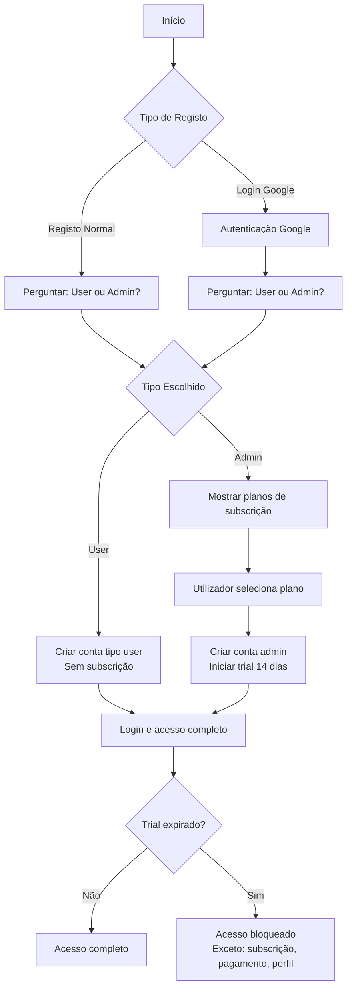

# Account Type Selection and Trial Management

## Overview

Modificar o fluxo de autenticação para permitir escolha entre conta "user" (condomino) ou "admin" durante o registo e login Google. Apenas contas admin precisam de subscrição e trial. Quando o trial expira, bloquear acesso a todas as páginas exceto subscrição, pagamento e perfil.

## Fluxo de Autenticação

## Alterações Necessárias

### 1. Model User - Adicionar métodos Google OAuth

**Ficheiro:** `app/Models/User.php`

- Adicionar método `findByGoogleId(string $googleId): ?array`
- Adicionar método `linkGoogleAccount(int $userId, string $googleId): bool`
- Atualizar método `create()` para suportar `google_id` e `auth_provider` (password opcional para OAuth)

### 2. Controller AuthController - Modificar fluxo de registo

**Ficheiro:** `app/Controllers/AuthController.php`

**Mudanças:**

- `register()`: Adicionar seleção de tipo de conta (user/admin) no formulário
- `processRegister()`: 
  - Processar seleção de tipo de conta
  - Se admin: redirecionar para seleção de plano ANTES de criar conta
  - Se user: criar conta diretamente sem subscrição
- `googleCallback()`:
  - Quando utilizador não existe e vem de registo: perguntar tipo de conta
  - Se admin: mostrar seleção de plano antes de criar conta
  - Se user: criar conta diretamente

**Novos métodos:**

- `selectAccountType()`: Página para escolher tipo de conta após Google OAuth
- `processAccountType()`: Processar escolha de tipo de conta
- `selectPlanForAdmin()`: Página para selecionar plano (quando admin escolhido)
- `processPlanSelection()`: Processar seleção de plano e criar conta admin com trial

### 3. Middleware SubscriptionMiddleware - Bloquear acesso quando trial expira

**Ficheiro:** `app/Middleware/SubscriptionMiddleware.php` (novo)

Criar middleware que:

- Verifica se utilizador é admin
- Se admin, verifica se tem subscrição ativa ou trial válido
- Se trial expirado e sem subscrição ativa, bloqueia acesso exceto:
  - `/subscription/*`
  - `/payments/*`
  - `/profile`
  - `/logout`
  - Rotas públicas (login, register, etc.)

### 4. Views - Adicionar seleção de tipo de conta

**Ficheiros:**

- `app/Views/pages/register.html.twig`: Adicionar campo para selecionar tipo de conta
- `app/Views/pages/auth/select-account-type.html.twig` (novo): Página para escolher tipo após Google OAuth
- `app/Views/pages/auth/select-plan.html.twig` (novo): Página para selecionar plano antes de criar conta admin

### 5. Routes - Adicionar novas rotas

**Ficheiro:** `routes.php`

- `POST /auth/select-account-type`: Processar escolha de tipo de conta
- `GET /auth/select-plan`: Mostrar seleção de plano
- `POST /auth/select-plan`: Processar seleção de plano e criar conta

### 6. Atualizar SubscriptionService

**Ficheiro:** `app/Services/SubscriptionService.php`

- Adicionar método `isTrialExpired(int $userId): bool`
- Adicionar método `hasActiveSubscription(int $userId): bool`

### 7. Atualizar AuthMiddleware ou criar SubscriptionMiddleware

Aplicar middleware de subscrição nas rotas protegidas (exceto as permitidas quando trial expira).

## Detalhes de Implementação

### Seleção de Tipo de Conta

- No registo normal: campo radio/select no formulário
- No Google OAuth: página intermediária após callback quando utilizador não existe

### Inicialização de Trial

- Apenas para contas admin
- Trial de 14 dias
- Criar subscrição com status 'trial' e `trial_ends_at` definido

### Bloqueio de Acesso

- Middleware verifica em cada requisição autenticada
- Se admin com trial expirado e sem subscrição ativa:
  - Redirecionar para `/subscription` com mensagem
  - Permitir apenas rotas de subscrição, pagamento e perfil

## Ordem de Implementação

1. Adicionar métodos Google OAuth no User model
2. Criar SubscriptionMiddleware
3. Modificar AuthController para suportar seleção de tipo
4. Criar views para seleção de tipo e plano
5. Adicionar rotas
6. Atualizar SubscriptionService com métodos de verificação
7. Aplicar middleware nas rotas protegidas
8. Testar fluxo completo