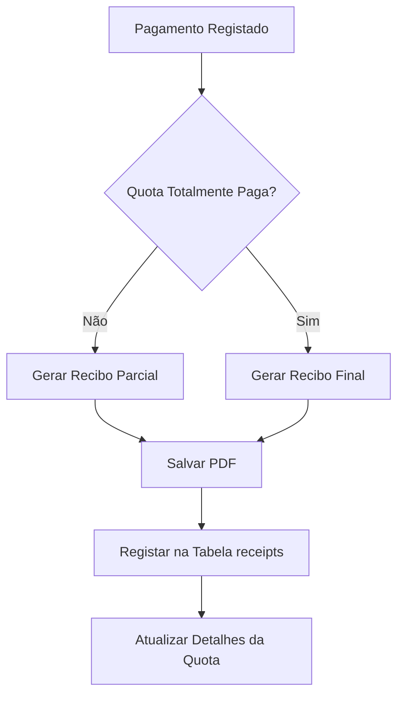

# Sistema de Recibos de Quotas

## Objetivo

Gerar automaticamente recibos em PDF quando há pagamentos de quotas, permitindo visualização nos detalhes da quota e consulta através de página dedicada.

## Estrutura de Dados

### Nova Tabela: `receipts`

- `id` (PK)
- `fee_id` (FK para fees)
- `fee_payment_id` (FK para fee_payments, nullable - null para recibo final)
- `condominium_id` (FK)
- `fraction_id` (FK)
- `receipt_number` (string único, formato: REC-{condominium_id}-{year}-{sequential})
- `receipt_type` (enum: 'partial', 'final')
- `amount` (decimal)
- `file_path` (string - caminho do PDF)
- `file_name` (string)
- `file_size` (integer)
- `generated_at` (datetime)
- `generated_by` (FK para users)
- `created_at`, `updated_at`

## Implementação

### 1. Migration

Criar `database/migrations/049_create_receipts_table.php`:

- Tabela `receipts` com campos acima
- Índices em `fee_id`, `fee_payment_id`, `condominium_id`, `fraction_id`, `receipt_number`
- Foreign keys apropriadas

### 2. Model

Criar `app/Models/Receipt.php`:

- Métodos: `create()`, `findById()`, `getByFee()`, `getByFraction()`, `getByCondominium()`, `getByUser()` (recebidos pelo condómino)
- `generateReceiptNumber()` - gera número sequencial único por ano/condomínio
- `getNextReceiptNumber()` - obtém próximo número da sequência

### 3. PdfService - Geração de Recibos

Adicionar em `app/Services/PdfService.php`:

- `generateReceiptReceipt(array $fee, array $fraction, array $condominium, array $payment = null, string $type = 'partial'): string`
  - Gera HTML do recibo com informações: condomínio, fração, período, valor, método de pagamento, referência, data
  - Layout profissional similar aos recibos existentes
  - Suporta recibo parcial (com dados do pagamento específico) e final (quando totalmente pago)
- `generateReceiptPdf(string $htmlContent, int $receiptId): string`
  - Converte HTML para PDF usando DomPDF
  - Salva em `storage/documents/receipts/`
  - Retorna nome do ficheiro

### 4. FinanceController - Geração Automática

Modificar `app/Controllers/FinanceController.php`:

- No método `addPayment()`:
  - Após criar o pagamento, gerar recibo parcial
  - Verificar se quota está totalmente paga
  - Se sim, gerar recibo final adicional
  - Salvar registo na tabela `receipts`
- Criar método privado `generateReceipt()` para encapsular lógica

### 5. ReceiptController

Criar `app/Controllers/ReceiptController.php`:

- `index(int $condominiumId)` - lista recibos do condomínio (filtros por fração, ano, tipo)
- `myReceipts()` - lista recibos do usuário logado (todas as frações)
- `show(int $condominiumId, int $receiptId)` - visualiza recibo em HTML
- `download(int $condominiumId, int $receiptId)` - download do PDF
- Verificar permissões: condómino só vê seus recibos, admin vê todos do condomínio

### 6. Rotas

Adicionar em `routes.php`:

- `GET /condominiums/{condominium_id}/receipts` - lista recibos (admin)
- `GET /receipts` - meus recibos (condómino)
- `GET /condominiums/{condominium_id}/receipts/{id}` - visualizar recibo
- `GET /condominiums/{condominium_id}/receipts/{id}/download` - download PDF

### 7. Visualização nos Detalhes da Quota

Modificar `app/Views/blocks/fees-map-modal.html.twig`:

- Adicionar secção "Recibos" após histórico de pagamentos
- Listar recibos relacionados à quota (parciais e final)
- Botões para visualizar e descarregar cada recibo
- Mostrar número do recibo, tipo, data de geração

### 8. Página de Listagem de Recibos

Criar `app/Views/pages/receipts/index.html.twig`:

- Tabela com: número, fração, período, tipo, valor, data de geração
- Filtros: condomínio, fração, ano, tipo (parcial/final)
- Ações: visualizar, descarregar
- Paginação se necessário

### 9. Página de Visualização de Recibo

Criar `app/Views/pages/receipts/show.html.twig`:

- Iframe ou embed do PDF
- Botão de download
- Informações do recibo

### 10. Menu/Navegação

- Adicionar item "Meus Recibos" no sidebar (condóminos)
- Adicionar item "Recibos" no menu de quotas (admin)

## Fluxo de Geração

## Considerações Técnicas

- Números de recibo únicos: formato `REC-{condominium_id}-{year}-{sequential}` (ex: REC-52-2025-001)
- Armazenamento: `storage/documents/receipts/`
- Permissões: usar `RoleMiddleware` para verificar acesso
- PDF: usar DomPDF (já disponível no projeto)
- Layout: seguir padrão visual dos outros documentos (atas, convocatórias)

## Arquivos a Criar/Modificar

**Novos:**

- `database/migrations/049_create_receipts_table.php`
- `app/Models/Receipt.php`
- `app/Controllers/ReceiptController.php`
- `app/Views/pages/receipts/index.html.twig`
- `app/Views/pages/receipts/show.html.twig`

**Modificar:**

- `app/Services/PdfService.php` - adicionar métodos de geração de recibos
- `app/Controllers/FinanceController.php` - gerar recibos após pagamentos
- `app/Views/blocks/fees-map-modal.html.twig` - mostrar recibos nos detalhes
- `app/Views/blocks/sidebar.html.twig` - adicionar link "Meus Recibos"
- `routes.php` - adicionar rotas de recibos