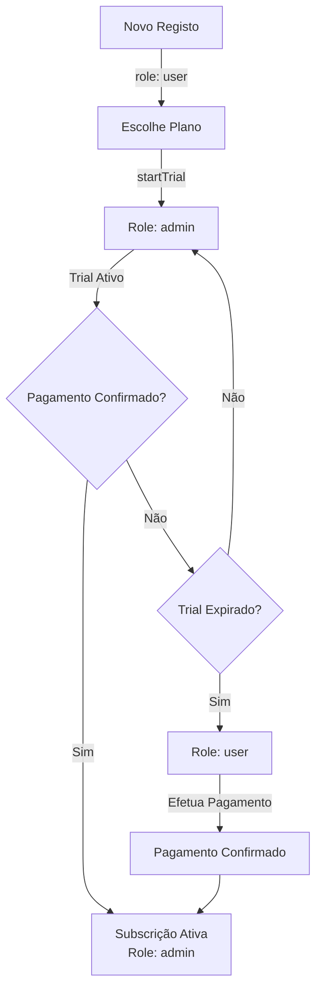

# Sistema de Roles Baseado em Subscrição

## Objetivo
Implementar sistema onde:
- Novos usuários são criados como `user` (não `admin`)
- Role muda para `admin` ao iniciar subscrição/trial
- Role volta para `user` se trial expirar sem pagamento
- Role volta para `admin` quando pagamento é confirmado e subscrição ativada

## Arquitetura

## Alterações Necessárias

### 1. Alterar Registo de Usuários
**Arquivo:** `app/Controllers/AuthController.php`
- Mudar role padrão de `'admin'` para `'user'` no método `processRegister()` (linha 228, 275)
- Mudar role padrão de `'admin'` para `'user'` no método `googleCallback()` (linha 703)
- Remover criação automática de trial no registo - trial só deve começar quando escolher plano

### 2. Criar Serviço de Gestão de Roles
**Arquivo:** `app/Services/RoleService.php` (novo)
- Método `updateRoleBasedOnSubscription(int $userId): void`
  - Verifica subscrição ativa do usuário
  - Se tem subscrição `active` ou `trial` válida → role = `admin`
  - Se não tem ou trial expirado → role = `user`
- Método `canAccessAdminFeatures(int $userId): bool`
  - Verifica se usuário pode aceder funcionalidades admin

### 3. Atualizar SubscriptionService
**Arquivo:** `app/Services/SubscriptionService.php`
- No método `startTrial()`: após criar trial, atualizar role do usuário para `admin`
- Criar método `activateSubscription(int $subscriptionId): bool`
  - Atualizar role do usuário para `admin` quando subscrição é ativada

### 4. Atualizar PaymentService
**Arquivo:** `app/Services/PaymentService.php`
- No método `confirmPayment()`: após ativar subscrição, atualizar role do usuário para `admin`

### 5. Criar Middleware de Verificação de Role
**Arquivo:** `app/Middleware/SubscriptionRoleMiddleware.php` (novo)
- Verificar role baseado em subscrição antes de permitir acesso a rotas admin
- Redirecionar para página de subscrição se não tiver acesso admin

### 6. Atualizar AuthController - Login
**Arquivo:** `app/Controllers/AuthController.php`
- No método `processLogin()` e `googleCallback()`: após login, verificar e atualizar role baseado em subscrição
- Atualizar role na sessão se necessário

### 7. Atualizar RoleMiddleware
**Arquivo:** `app/Middleware/RoleMiddleware.php`
- Integrar verificação de subscrição antes de verificar role
- Se usuário tem role `admin` mas subscrição expirada, tratar como `user`

### 8. Atualizar SubscriptionController
**Arquivo:** `app/Controllers/SubscriptionController.php`
- No método `startTrial()`: após iniciar trial, atualizar role para `admin`
- Adicionar verificação para garantir que usuário tem role correto após operações de subscrição

### 9. Criar Job/Cron para Verificar Trials Expirados
**Arquivo:** `cli/check-expired-trials.php` (novo)
- Verificar trials expirados sem pagamento
- Atualizar role de `admin` para `user` automaticamente
- Executar via cron diariamente

### 10. Atualizar Views
**Arquivos:** Views que mostram informações de subscrição
- Mostrar aviso quando trial está prestes a expirar
- Mostrar mensagem quando acesso admin está bloqueado por falta de pagamento

## Fluxo de Dados

1. **Registo**: Usuário criado com `role = 'user'`
2. **Escolha de Plano**: Ao escolher plano, `startTrial()` é chamado → role muda para `admin`
3. **Trial Ativo**: Usuário tem acesso admin enquanto trial está ativo
4. **Trial Expira**: Se não pagou, job cron atualiza role para `user`
5. **Pagamento**: Quando pagamento é confirmado, role volta para `admin`
6. **Verificação Contínua**: Middleware verifica role em cada requisição

## Pontos de Verificação

- Login: Verificar e atualizar role baseado em subscrição
- Middleware: Verificar role antes de permitir acesso admin
- Webhook de Pagamento: Atualizar role quando pagamento confirmado
- Cron Job: Verificar trials expirados diariamente

## Considerações

- Usuários existentes com role `admin` devem manter acesso até verificação manual ou expiração de trial
- Sistema deve ser retrocompatível com usuários que já têm subscrições ativas
- Logs devem ser criados quando role é alterado automaticamente