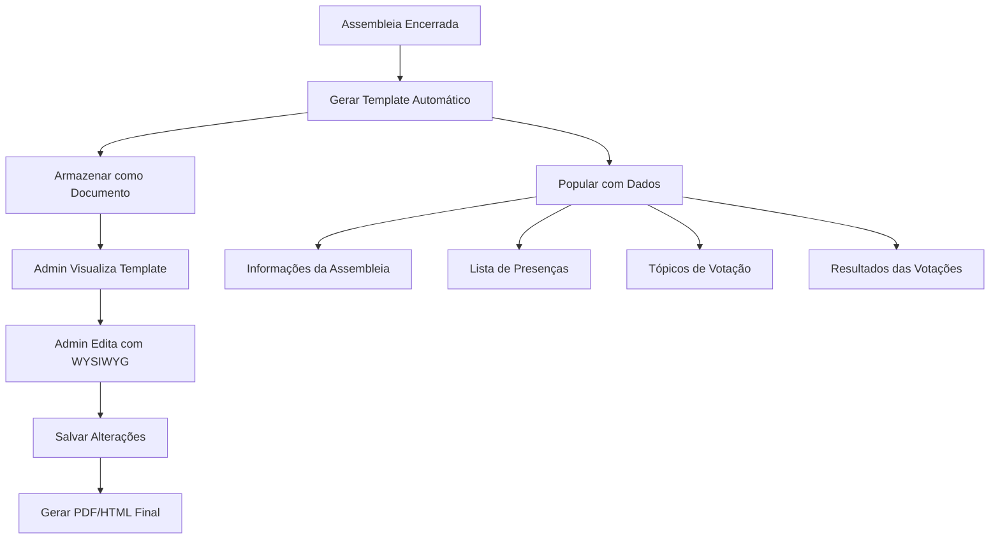

# Sistema de Template de Atas Editável

## Objetivo

Criar um sistema onde, ao encerrar uma assembleia, um template de ata é gerado automaticamente e armazenado como documento. O admin pode editar este template usando um editor WYSIWYG e depois gerar a ata final.

## Arquitetura

## Implementação

### 1. Modificar método `close` em `AssemblyController`

- Após encerrar a assembleia (`status = 'closed'`), gerar automaticamente o template de ata
- Chamar novo método `generateMinutesTemplate` que cria o documento editável
- Armazenar o documento com `document_type = 'minutes_template'` para diferenciar de atas finais

### 2. Criar método `generateMinutesTemplate` em `AssemblyController`

- Buscar dados da assembleia, presenças, tópicos e resultados de votação
- Gerar HTML template usando `PdfService::getMinutesHtml` como base
- Criar documento no sistema com:
  - `title`: "Template de Atas: [Título da Assembleia]"
  - `document_type`: "minutes_template"
  - `file_path`: caminho do arquivo HTML
  - `visibility`: "admin" (apenas admin pode editar)
- Retornar ID do documento criado

### 3. Criar método `editMinutesTemplate` em `AssemblyController`

- Verificar se assembleia está encerrada
- Buscar documento do template (`document_type = 'minutes_template'` e `assembly_id` relacionado)
- Carregar conteúdo HTML do arquivo
- Renderizar view de edição com editor WYSIWYG

### 4. Criar método `updateMinutesTemplate` em `AssemblyController`

- Validar CSRF token
- Verificar permissões (apenas admin)
- Atualizar conteúdo HTML do arquivo
- Opcionalmente atualizar metadata do documento
- Redirecionar com mensagem de sucesso

### 5. Modificar método `generateMinutes` em `AssemblyController`

- Verificar se existe template editado (`document_type = 'minutes_template'`)
- Se existir, usar conteúdo do template editado
- Se não existir, usar geração automática padrão
- Gerar PDF/HTML final usando conteúdo escolhido

### 6. Adicionar campo `assembly_id` na tabela `documents` (migration)

- Criar migration para adicionar coluna `assembly_id INT NULL` com foreign key
- Permitir relacionar documentos com assembleias
- Adicionar índice para melhor performance

### 7. Criar view `edit-minutes-template.html.twig`

- Formulário com editor WYSIWYG (TinyMCE ou CKEditor)
- Campo hidden para CSRF token
- Botão "Guardar" e "Cancelar"
- Preview do template (opcional)
- Instruções de uso do editor

### 8. Integrar editor WYSIWYG

- Adicionar TinyMCE via CDN ou CKEditor
- Configurar toolbar com formatação básica (negrito, itálico, listas, etc.)
- Permitir edição de HTML completo
- Sanitizar HTML na submissão para segurança

### 9. Atualizar view `show.html.twig` de assembleias

- Adicionar botão "Editar Template de Atas" quando assembleia estiver encerrada
- Mostrar link para visualizar template se existir
- Indicar se template foi editado ou não

### 10. Adicionar rotas em `routes.php`

- `GET /condominiums/{condominium_id}/assemblies/{id}/minutes-template/edit` → `editMinutesTemplate`
- `POST /condominiums/{condominium_id}/assemblies/{id}/minutes-template/update` → `updateMinutesTemplate`

## Arquivos a Modificar

1. `app/Controllers/AssemblyController.php`

   - Modificar `close()` para gerar template automaticamente
   - Adicionar `generateMinutesTemplate()`
   - Adicionar `editMinutesTemplate()`
   - Adicionar `updateMinutesTemplate()`
   - Modificar `generateMinutes()` para usar template editado se existir

2. `app/Models/Document.php`

   - Adicionar método `getByAssemblyId()` para buscar documentos relacionados
   - Adicionar suporte para `assembly_id` em queries

3. `app/Services/PdfService.php`

   - Criar método `getMinutesTemplateHtml()` que retorna HTML editável (sem formatação final de PDF)
   - Manter `getMinutesHtml()` para geração final

4. `app/Views/pages/assemblies/show.html.twig`

   - Adicionar botão para editar template quando assembleia estiver encerrada
   - Mostrar status do template (editado/não editado)

5. `app/Views/pages/assemblies/edit-minutes-template.html.twig` (NOVO)

   - Formulário com editor WYSIWYG
   - Campos para edição do conteúdo

6. `database/migrations/041_add_assembly_id_to_documents.php` (NOVO)

   - Adicionar coluna `assembly_id` à tabela `documents`

7. `routes.php`

   - Adicionar rotas para edição de template

## Considerações de Segurança

- Validar que apenas admins podem editar templates
- Sanitizar HTML usando `Security::sanitize()` ou biblioteca HTMLPurifier
- Validar CSRF tokens em todas as submissões
- Verificar que assembleia pertence ao condomínio correto

## Dependências

- Editor WYSIWYG (TinyMCE via CDN recomendado por simplicidade)
- Biblioteca de sanitização HTML (opcional, usar `htmlspecialchars` básico ou HTMLPurifier)

## Fluxo de Uso

1. Admin encerra assembleia → Template é gerado automaticamente
2. Admin clica em "Editar Template de Atas"
3. Editor WYSIWYG abre com conteúdo pré-populado
4. Admin faz alterações necessárias
5. Admin salva → Template é atualizado
6. Admin pode gerar PDF/HTML final usando template editado
7. Condôminos podem visualizar ata final gerada