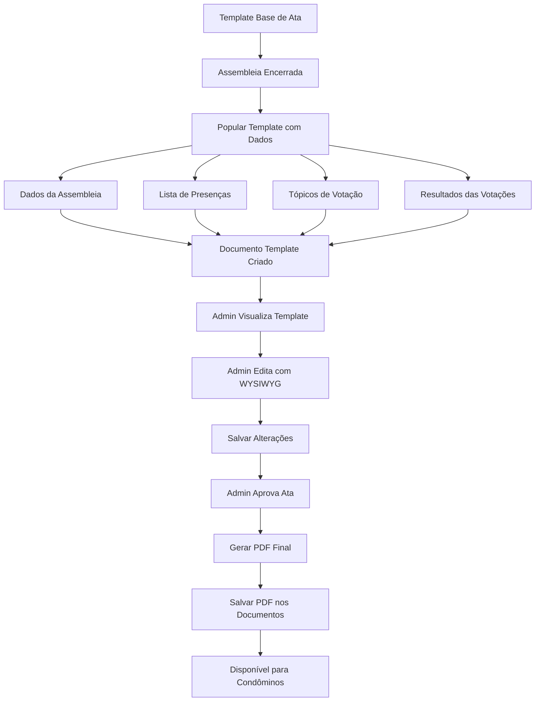

# Sistema de Template de Atas Editável com Aprovação

## Objetivo

Criar um template base de ata que será usado para gerar atas automaticamente. Ao encerrar uma assembleia, o template é populado com os dados da assembleia (informações, presenças, tópicos, votações). O admin pode editar o conteúdo usando um editor WYSIWYG. Quando aprovado, gera automaticamente o PDF final e salva nos documentos do condomínio.

## Arquitetura

## Implementação

### 1. Criar Template Base de Ata

- Criar arquivo template HTML base em `app/Templates/minutes_template.html` ou similar
- Template deve conter placeholders/variáveis que serão substituídos pelos dados:
  - `{{assembly_title}}` - Título da assembleia
  - `{{assembly_date}}` - Data da assembleia
  - `{{assembly_type}}` - Tipo de assembleia
  - `{{attendees_list}}` - Lista de presenças (HTML formatado)
  - `{{topics_list}}` - Lista de tópicos de votação (HTML formatado)
  - `{{votes_results}}` - Resultados das votações (HTML formatado)
  - `{{quorum_info}}` - Informações sobre quórum
- Template deve ter estrutura HTML completa com estilos para impressão/PDF

### 2. Criar método `populateMinutesTemplate` em `PdfService`

- Receber template base e dados da assembleia
- Substituir placeholders pelos dados reais:
  - Formatar lista de presenças em HTML
  - Formatar tópicos e resultados de votação em HTML
  - Formatar informações da assembleia
- Retornar HTML populado

### 3. Modificar método `close` em `AssemblyController`

- Após encerrar a assembleia (`status = 'closed'`), gerar automaticamente o template populado
- Chamar `generateMinutesTemplate()` que:
  - Carrega template base
  - Busca dados da assembleia, presenças, tópicos e resultados
  - Popula template com dados usando `populateMinutesTemplate()`
  - Cria documento editável
- Armazenar o documento com `document_type = 'minutes_template'` e `status = 'draft'`

### 4. Criar método `generateMinutesTemplate` em `AssemblyController`

- Buscar dados da assembleia, presenças, tópicos e resultados de votação
- Carregar template base de arquivo
- Chamar `PdfService::populateMinutesTemplate()` para popular template
- Criar documento no sistema com:
  - `title`: "Template de Atas: [Título da Assembleia]"
  - `document_type`: "minutes_template"
  - `file_path`: caminho do arquivo HTML populado
  - `visibility`: "admin" (apenas admin pode editar)
  - `assembly_id`: ID da assembleia relacionada
  - `status`: "draft"
- Retornar ID do documento criado

### 5. Criar método `editMinutesTemplate` em `AssemblyController`

- Verificar se assembleia está encerrada
- Buscar documento do template (`document_type = 'minutes_template'` e `assembly_id` relacionado)
- Carregar conteúdo HTML do arquivo
- Renderizar view de edição com editor WYSIWYG

### 6. Criar método `updateMinutesTemplate` em `AssemblyController`

- Validar CSRF token
- Verificar permissões (apenas admin)
- Validar que status é 'draft' (não pode editar após aprovação)
- Atualizar conteúdo HTML do arquivo
- Opcionalmente atualizar metadata do documento
- Redirecionar com mensagem de sucesso

### 7. Criar método `approveMinutes` em `AssemblyController`

- Validar CSRF token
- Verificar permissões (apenas admin)
- Buscar template editado (`document_type = 'minutes_template'` e `status = 'draft'`)
- Carregar conteúdo HTML do template
- Gerar PDF final usando conteúdo do template
- Salvar PDF nos documentos do condomínio com:
  - `title`: "Atas Aprovadas: [Título da Assembleia]"
  - `document_type`: "minutes"
  - `file_path`: caminho do arquivo PDF
  - `visibility`: "condominos" (visível para todos)
  - `assembly_id`: ID da assembleia relacionada
- Atualizar status do template para 'approved'
- Redirecionar com mensagem de sucesso

### 8. Adicionar campo `assembly_id` e `status` na tabela `documents` (migration)

- Criar migration para adicionar:
  - Coluna `assembly_id INT NULL` com foreign key para `assemblies(id)`
  - Coluna `status` ENUM('draft', 'approved') DEFAULT 'draft'
- Permitir relacionar documentos com assembleias
- Adicionar índice para melhor performance

### 9. Criar view `edit-minutes-template.html.twig`

- Formulário com editor WYSIWYG (TinyMCE ou CKEditor)
- Campo hidden para CSRF token
- Textarea/editor com conteúdo HTML do template populado
- Botão "Guardar" para salvar alterações
- Botão "Aprovar e Gerar PDF" que chama `approveMinutes`
- Botão "Cancelar" para voltar
- Preview do template (opcional)
- Instruções de uso do editor
- Indicador de status (rascunho/aprovado)

### 10. Integrar editor WYSIWYG

- Adicionar TinyMCE via CDN ou CKEditor
- Configurar toolbar com formatação completa (negrito, itálico, listas, tabelas, etc.)
- Permitir edição de HTML completo
- Configurar para manter estrutura do template
- Sanitizar HTML na submissão para segurança

### 11. Criar método de geração de PDF em `PdfService`

- Criar método `generateMinutesPdf()` que converte HTML para PDF
- Usar biblioteca como TCPDF, DomPDF ou mPDF
- Ou manter HTML e usar conversão no navegador (print to PDF)
- Aplicar estilos adequados para impressão

### 12. Atualizar view `show.html.twig` de assembleias

- Adicionar botão "Editar Template de Atas" quando assembleia estiver encerrada e template existe
- Mostrar status do template (rascunho/aprovado)
- Mostrar link para visualizar template se existir
- Mostrar link para PDF aprovado se existir
- Indicar se template foi editado ou não

### 13. Adicionar rotas em `routes.php`

- `GET /condominiums/{condominium_id}/assemblies/{id}/minutes-template/edit` → `editMinutesTemplate`
- `POST /condominiums/{condominium_id}/assemblies/{id}/minutes-template/update` → `updateMinutesTemplate`
- `POST /condominiums/{condominium_id}/assemblies/{id}/minutes-template/approve` → `approveMinutes`

## Arquivos a Criar/Modificar

1. `app/Templates/minutes_template.html` (NOVO)

   - Template base com placeholders para dados da assembleia

2. `app/Controllers/AssemblyController.php`

   - Modificar `close()` para gerar template automaticamente
   - Adicionar `generateMinutesTemplate()` - popula template com dados
   - Adicionar `editMinutesTemplate()`
   - Adicionar `updateMinutesTemplate()`
   - Adicionar `approveMinutes()` - gera PDF e salva

3. `app/Models/Document.php`

   - Adicionar método `getByAssemblyId()` para buscar documentos relacionados
   - Adicionar suporte para `assembly_id` e `status` em queries

4. `app/Services/PdfService.php`

   - Adicionar `populateMinutesTemplate()` - popula template base com dados
   - Adicionar `generateMinutesPdf()` - gera PDF final
   - Manter `getMinutesHtml()` para compatibilidade

5. `app/Views/pages/assemblies/show.html.twig`

   - Adicionar botão para editar template quando assembleia estiver encerrada
   - Mostrar status do template (rascunho/aprovado)
   - Mostrar link para PDF aprovado se existir

6. `app/Views/pages/assemblies/edit-minutes-template.html.twig` (NOVO)

   - Formulário com editor WYSIWYG
   - Botão "Aprovar e Gerar PDF"

7. `database/migrations/041_add_assembly_id_to_documents.php` (NOVO)

   - Adicionar coluna `assembly_id` à tabela `documents`
   - Adicionar coluna `status` ENUM('draft', 'approved')

8. `routes.php`

   - Adicionar rotas para edição e aprovação de template

## Considerações de Segurança

- Validar que apenas admins podem editar e aprovar templates
- Sanitizar HTML usando `Security::sanitize()` ou biblioteca HTMLPurifier
- Validar CSRF tokens em todas as submissões
- Verificar que assembleia pertence ao condomínio correto
- Validar que apenas templates em draft podem ser editados
- Validar que apenas templates aprovados podem ser visualizados por condôminos

## Dependências

- Editor WYSIWYG (TinyMCE via CDN recomendado por simplicidade)
- Biblioteca de sanitização HTML (opcional, usar `htmlspecialchars` básico ou HTMLPurifier)
- Biblioteca de geração de PDF (TCPDF, DomPDF ou mPDF) - se necessário

## Fluxo de Uso

1. Template base de ata existe no sistema
2. Admin encerra assembleia → Template base é populado com dados da assembleia → Documento criado (status: draft)
3. Admin clica em "Editar Template de Atas"
4. Editor WYSIWYG abre com conteúdo pré-populado
5. Admin faz alterações necessárias
6. Admin salva → Template é atualizado (mantém status: draft)
7. Admin clica em "Aprovar e Gerar PDF"
8. Sistema gera PDF final usando template editado
9. PDF é salvo nos documentos do condomínio (visível para condôminos)
10. Template é marcado como aprovado (status: approved)
11. Condôminos podem visualizar e baixar PDF aprovado